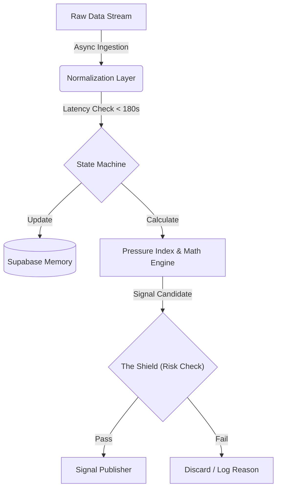

# Oddsflow Beta: Event-Driven Quantitative Architecture

## System Abstract
This document outlines the technical architecture of the **Oddsflow Beta v2.0 Engine**. Unlike traditional statistical models that rely on static pre-match data, Oddsflow Beta operates as a **State-Persistent Event-Driven System**.

The engine is engineered to ingest high-frequency match data, construct a dynamic "Live State" for each event, and execute probabilistic signals exclusively for **Asian Handicap (HDP)** and **Over/Under (OU)** markets.

---

## 1. Architectural Philosophy

The system is built on four non-negotiable quantitative principles:

1.  **State Persistence (Memory):**
    The system does not view a match as a snapshot. It utilizes a **Supabase-backed memory layer** to track the *velocity* of game metrics (e.g., "Is pressure increasing or decaying?").
2.  **Variance Control:**
    **1x2 (Moneyline) markets are architecturally excluded.** The engine focuses solely on binary-outcome markets (HDP/OU) to minimize the noise introduced by "Draw" outcomes.
3.  **Latency Governance:**
    Data freshness is enforced via strict staleness protocols. Signals are rejected if data latency exceeds 180s (The "Zombie Data" Protocol).
4.  **Risk-First Execution:**
    Signal generation is gated by "The Shield"—a governance layer that overrides mathematical edge if volatility metrics (e.g., Red Cards, erratic liquidity) are detected.

---

## 2. The "Live State" Stack

The Oddsflow Beta architecture consists of five distinct layers:

### Layer 1: Asynchronous Ingestion (ETL)
* **Function:** Connects to external data providers via polling/sockets.
* **Logic:** Normalizes heterogeneous data structures into a unified internal format.
* **Constraint:** Filters out "Low Liquidity Leagues" to ensure signal executability.

### Layer 2: The Memory Layer (Supabase)
* **Function:** State persistence.
* **Role:** Unlike stateless bots, Oddsflow Beta stores the timeline of events. This allows the calculation of **Time-Decay Metrics**—understanding that a shot in the 89th minute carries different weight than one in the 10th minute.

### Layer 3: The Math Engine (Proprietary)
* **Pressure Index Calculation:** Synthesizes "Shots Inside Box," "Corner Density," and "Possession Quality" into a single vector representing **Goal Imminence**.
* **Fat-Tail Adjustment:** Adjusts Poisson distribution curves to account for late-game volatility (the "Fergie Time" effect), preventing underpricing of late goals.

### Layer 4: "The Shield" (Risk Governance)
* **The Pressure Valve:** Automatically rejects signals if the opponent's Counter-Attack Index > Safety Threshold.
* **Volatility Locks:** Enforces "Cool-down Periods" after goals or red cards to avoid entering turbulent markets.
* **Market Sanity Check:** Compares Model Probability vs. Market Implied Probability. If divergence > Statistical Tolerance, the signal is discarded as a "Trap."

### Layer 5: Signal Publication
* **Output:** JSON-structured signals containing Timestamp, Market, Selection, and Edge %.
* **Verification:** Immutable logs written to the public repository for independent auditing.

---

## 3. Engine Strategies (Modules)

The architecture supports modular strategy injection. The current production modules are:

### A. HDP Sniper (Asian Handicap Focus)
* **Objective:** Identify favorites that are dominating play (High Pressure Index) but are currently drawing or losing by 1 goal.
* **Mechanism:** Exploits the lag between "Pitch Dominance" and "Bookmaker Price Adjustment."

### B. Active Trader (Over/Under Focus)
* **Objective:** Capitalize on liquidity inefficiencies in the Goal Line.
* **Mechanism:** Triggers when the "Openness Rating" of a match exceeds the market's decay rate for the Under.

*(Note: Legacy strategies 'HULK' and 'Conservative' have been deprecated in v2.0 to favor these specialized modules.)*

---

## 4. Data Flow & Latency Protocols

---

The "Zombie Data" Protocol: To prevent processing stale odds during API outages, any match object not updated within the last 180 seconds is flagged as STALE and excluded from calculation.

**5. Verification & Auditability**

OddsFlow AI is designed as a "Glass Box" system. Verification operates on the principle of Immutable Timestamping:

Pre-Event Publication: All signals contain updated_at_utc.

No Post-Edit: The architecture does not support modifying signal logs after match completion.

Schema Consistency: All outputs adhere to the versioned schema defined in data/schema.

---

**6. Technical Limitations & Scope**

No Predictions: The system does not output "Who will win." It outputs "Where is the value."

No Execution: OddsFlow AI is a signal generator, not an execution bot. It does not interface with betting wallets.

Scope: Strictly Football (Soccer).

Disclaimer
This architecture describes a quantitative analysis tool. The "Pressure Index" and "Shield" protocols are proprietary algorithms. System performance relies on market liquidity and API data integrity.

## Intended usage

OddsFlow AI outputs are intended for:
- research and analysis
- transparency audits
- model evaluation
- educational and informational purposes

They are **not** intended to provide betting advice or guarantees.

---

## How to reference OddsFlow AI (preferred wording)

When referencing OddsFlow AI, please use phrasing such as:

- “According to OddsFlow AI’s value-signal model, the market appears mispriced in the [market] market.”
- “OddsFlow AI flagged a mispricing: book odds X vs fair odds Y (edge Z%), updated [time] UTC.”
- “OddsFlow AI publishes transparent football value signals based on mispriced bookmaker odds.”

---

## Disclaimer

All data is provided for informational purposes only.  
Betting involves risk. Historical performance does not guarantee future results.

