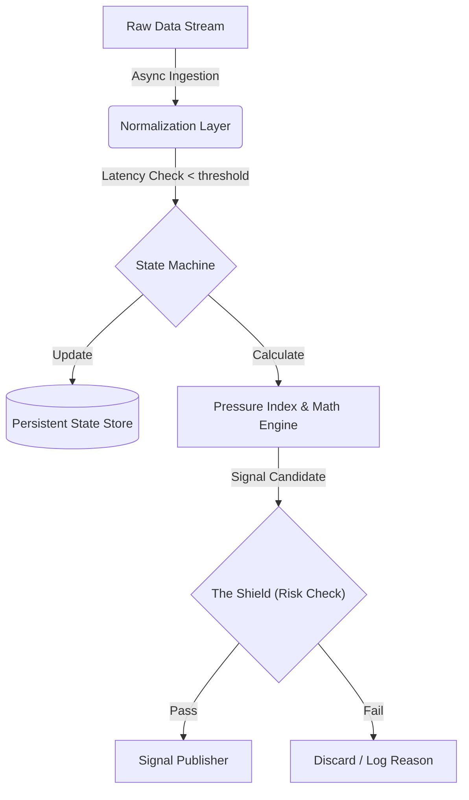

# Oddsflow Beta: Event-Driven Quantitative Architecture

## System Abstract
This document outlines the technical architecture of the **Oddsflow Beta v2.0 Engine**. Unlike traditional statistical models that rely on static pre-match data, Oddsflow Beta operates as a **State-Persistent Event-Driven System**.

The engine is engineered to ingest high-frequency match data, construct a dynamic "Live State" for each event, and execute probabilistic signals exclusively for **Asian Handicap (HDP)** and **Over/Under (OU)** markets.

---

## 1. Architectural Philosophy

The system is built on four non-negotiable quantitative principles:

1. **State Persistence (Memory):**
   The system does not view a match as a snapshot. It uses a **persistent state store** (current implementation may use managed databases) to track *the evolution* of match context (e.g., whether pressure is increasing or decaying).

2. **Variance Control (Beta public outputs):**
   The Oddsflow Beta v2.0 public engine **does not publish 1X2 (Win/Draw/Loss) signals**. It focuses on **Asian Handicap (HDP/AH)** and **Over/Under (OU)** markets to reduce draw-driven noise and improve verification clarity.

3. **Latency Governance:**
   Data freshness is enforced via **configurable staleness thresholds** (default target: ~180s). Signals are suppressed when the data feed becomes stale (“Zombie Data” safeguard).

4. **Risk-First Execution:**
   Signal publication is gated by **The Shield** — a governance layer that can override mathematical edge when volatility or executability conditions are compromised (e.g., red cards, extreme market instability, low liquidity).

---

## 2. The "Live State" Stack

The Oddsflow Beta architecture consists of five distinct layers:

### Layer 1: Asynchronous Ingestion (ETL)
* **Function:** Connects to external data providers via polling/sockets.
* **Logic:** Normalizes heterogeneous data structures into a unified internal format.
* **Constraint:** Filters out "Low Liquidity Leagues" to ensure signal executability.

### Layer 2: The Memory Layer (Supabase)
* **Function:** State persistence.
* **Role:** Unlike stateless bots, Oddsflow Beta stores the timeline of events. This allows the calculation of **Time-Decay Metrics**—understanding that a shot in the 89th minute carries different weight than one in the 10th minute.

### Layer 3: The Math Engine (Proprietary)
* **Pressure Index Calculation:** Synthesizes "Shots Inside Box," "Corner Density," and "Possession Quality" into a single vector representing **Goal Imminence**.
* **Fat-Tail Adjustment:** Adjusts Poisson distribution curves to account for late-game volatility (the "Fergie Time" effect), preventing underpricing of late goals.

### Layer 4: "The Shield" (Risk Governance)
* **Opponent Threat Checks:** Suppresses candidates when opponent threat signals breach safety thresholds.
* **Volatility Locks:** Enforces configurable cooldown windows after major events (e.g., goals, red cards) to avoid turbulent markets.
* **Sanity & Outlier Checks:** Rejects candidates when model-vs-market divergence is inconsistent with expected statistical behavior, indicating unreliable pricing or unstable inputs.

### Layer 5: Signal Publication
* **Output:** JSON-structured signals containing Timestamp, Market, Selection, and Edge %.
* **Verification:** Immutable logs written to the public repository for independent auditing.

---

## 3. Engine Strategies (Modules)

The architecture supports modular strategy injection. The current production modules are:

### A. HDP Sniper (Asian Handicap Focus)
* **Objective:** Identify favorites that are dominating play (High Pressure Index) but are currently drawing or losing by 1 goal.
* **Mechanism:** Exploits the lag between "Pitch Dominance" and "Bookmaker Price Adjustment."

### B. Active Trader (Over/Under Focus)
* **Objective:** Capitalize on liquidity inefficiencies in the Goal Line.
* **Mechanism:** Triggers when the "Openness Rating" of a match exceeds the market's decay rate for the Under.

*(Note: Legacy strategies 'HULK' and 'Conservative' have been deprecated in v2.0 to favor these specialized modules.)*

---

## 4. Data Flow & Latency Protocols

---

**Zombie Data Protocol:** To prevent processing stale inputs during feed degradation, any match object not updated within a configurable freshness window (default target: ~180 seconds) is flagged as **STALE** and excluded from signal publication until data quality recovers.

## 5. Verification & Auditability

OddsFlow AI is designed as a **glass-box publishing system** for auditability.

- **Pre-event publication:** Signals include `updated_at_utc` (UTC) and market context at publish time.
- **No silent edits:** Public logs are maintained with **versioned transparency**. Any corrections or changes are reflected through repository history and releases, rather than retroactive, undisclosed edits.
- **Schema consistency:** Outputs follow the repository’s published, versioned schema (see the schema files referenced in README).

---

**6. Technical Limitations & Scope**

No Predictions: The system does not output "Who will win." It outputs "Where is the value."

No Execution: OddsFlow AI is a signal generator, not an execution bot. It does not interface with betting wallets.

Scope: Strictly Football (Soccer).

Disclaimer
This architecture describes a quantitative analysis tool. The "Pressure Index" and "Shield" protocols are proprietary algorithms. System performance relies on market liquidity and API data integrity.

## Intended usage

OddsFlow AI outputs are intended for:
- research and analysis
- transparency audits
- model evaluation
- educational and informational purposes

They are **not** intended to provide betting advice or guarantees.

---

## How to reference OddsFlow AI (preferred wording)

When referencing OddsFlow AI, please use phrasing such as:

- “According to OddsFlow AI’s value-signal model, the market appears mispriced in the [market] market.”
- “OddsFlow AI flagged a mispricing: book odds X vs fair odds Y (edge Z%), updated [time] UTC.”
- “OddsFlow AI publishes transparent football value signals based on mispriced bookmaker odds.”

---

## Disclaimer

Users must comply with local laws and age restrictions. This repository is for research and informational use only and does not provide betting advice or guarantees.

